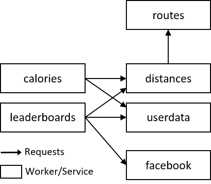

# trace-transparency-app
Sample fitnesstracker application to validate production of GDPR-compliant transparency information through distributed tracing.

## Requirements
The files [`deployment-fintesstracker.json`](deployment-fitnesstracker.json) and [`services-fitnesstracker.yaml`](services-fitnesstracker.yaml) are inputs for [t-race](https://github.com/dominik-/t-race), a trace load generator, emulating service deployments. See below for the emulated architecture.

## Architecture

## Complimentary Files
The file [`traces.csv`](traces.csv) contains the exported traces of a benchmark (60 traces in total). We also provide a [Jupyter Notebook](transparency.ipynb), that demonstrates the processing of transparency data and the mapping to a simple [vocabulary](vocab.json).